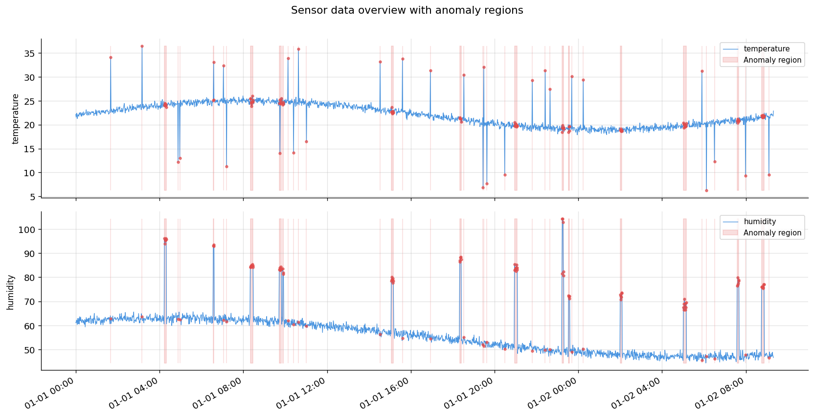
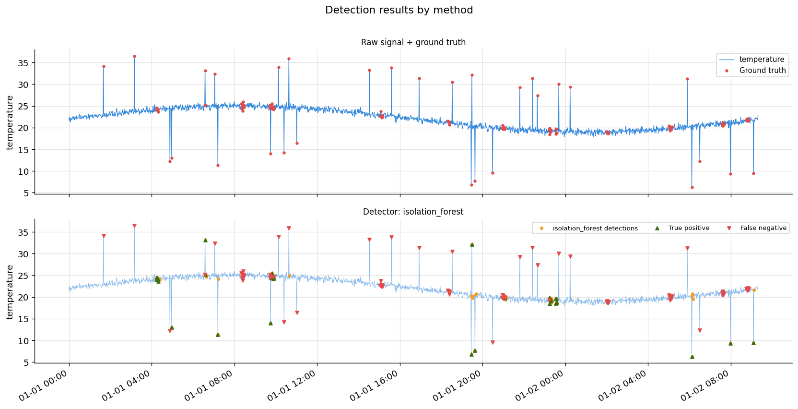
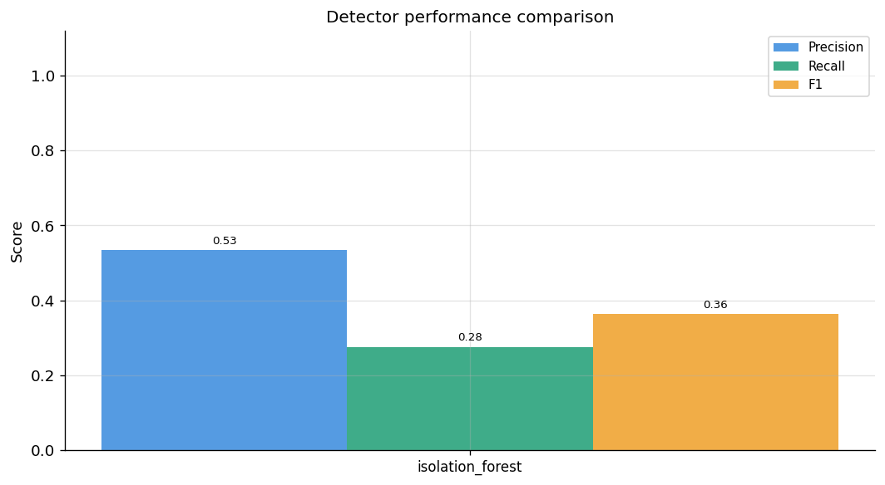

# Sensor Anomaly Detection

**End-to-end time-series anomaly detection pipeline for multi-channel sensor data.**

This project implemented three detection methods and applied them to sensor data streams, while also comparing these methods. The process covered the entire workflow, from raw data collection to the generation of evaluation reports.

---

## Motivation

Current advancements in industrial and IoT systems, as well as artificial intelligence, generate a continuous stream of sensor data, in which undetected anomalies can lead to equipment failures, process deviations, or measurement errors. This project presents a structured and effective anomaly detection method.

---

## Methods

| Tier | Method | Library | Use case |
|------|--------|---------|----------|
| Statistical | Z-score + rolling window | NumPy, Pandas | Fast baseline, interpretable |
| Machine learning | Isolation Forest | Scikit-learn | Unsupervised, no labels needed |
| Deep learning | LSTM Autoencoder | PyTorch | Captures temporal dependencies |

---

## Project Structure

```
sensor-anomaly-detection/
├── src/
│   ├── data_loader.py          # Data ingestion and preprocessing
│   ├── feature_engineering.py  # Rolling statistics, lag features
│   ├── anomaly_detection.py    # All three detection methods, but two of them was used
│   ├── visualization.py        # Plotting and reporting
│   └── pipeline.py             # End-to-end orchestration
├── data/
│   ├── raw/                    # Original sensor CSV files
│   └── processed/              # Cleaned, feature-enriched data
├── notebooks/
│   └── exploration.ipynb       # My own observations
├── reports/
│   └── figures/                # Generated plots
├── main.py                     # entry point
└── requirements.txt
```

---

## Dataset

The pipeline works with any multi-channel time-series CSV. By default it generates synthetic sensor data (temperature + humidity channels with injected anomalies) so you can run it immediately without downloading anything.

To use the **Numenta Anomaly Benchmark (NAB)**:
```bash
git clone https://github.com/numenta/NAB.git
cp NAB/data/realKnownCause/machine_temperature_system_failure.csv data/raw/
```

---

## Quick Start

```bash
# 1. Clone the repository
git clone https://github.com/fengfengnb1/sensor-anomaly-detection.git
cd sensor-anomaly-detection

# 2. Install dependencies
pip install -r requirements.txt

# 3. Run with synthetic data (no download needed)
python main.py --mode synthetic

# 4. Run with CSV
python main.py --input data/raw/sensor_data.csv --channel temperature

# 5. Run all three detection methods and compare
python main.py --mode synthetic --method all
```

---

## Results

### Sensor overview：raw signal with anomaly regions



### Detection results： Isolation Forest



### Method performance



| Method | Precision | Recall | F1 Score |
|--------|-----------|--------|----------|
| Isolation Forest | 0.53 | 0.28 | 0.36 |

1. The F1 score reflects performance under data imbalance; since the model was trained without labels, it is difficult to assess based solely on feature density.
2. The contamination parameter was set to 0.03. Adding Z-scores as a
baseline and using LSTM to handle time-series patterns can improve the overall recall rate.

---

## Key Features

- **Automated data pipeline**: ingestion → cleaning → feature extraction → detection → evaluation
- **Reproducible**: fixed random seeds, all parameters in one config block
- **Extensible**: add new methods by subclassing `BaseDetector` in `anomaly_detection.py`
- **Visualization**: time-series plots with annotated anomaly regions, precision-recall curves

---

## Skills Demonstrated

- Time-series data engineering (NumPy, Pandas)
- Unsupervised anomaly detection (IsolationForest, Z-score)
- Deep learning for sequential data (LSTM, PyTorch)
- End-to-end ML pipeline design
- Data quality control and validation

---

## Requirements

Python 3.9+ · See `requirements.txt` for full list.

---

## Author

**Hongfeng Li**   M.Sc. Electrical Engineering and Information Technology, University of Bremen  
hongfeng.li09@outlook.com
